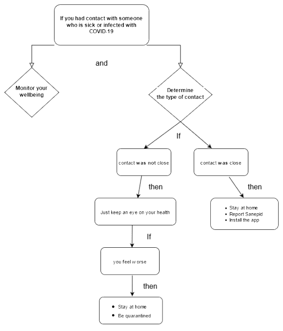

Contact with a sick or infected person
=====================================

If you suspect you have been in contact with someone infected with coronavirus, determine the type of contact and monitor your wellbeing. What else should you do? Determine whether the contact was close or not. For more details see the diagram below and read the further instructions.

